README
======

  [![PayPal][paypal-donate-image]][paypal-donate-link] [![Flattr this git repo][flattr-donate-image]][flattr-donate-link]

[paypal-donate-image]: https://www.paypalobjects.com/en_US/i/btn/btn_donate_SM.gif
[paypal-donate-link]: https://www.paypal.com/cgi-bin/webscr?cmd=_donations&business=voidex%40live%2ecom&lc=US&no_note=0&currency_code=USD&bn=PP%2dDonationsBF%3abtn_donate_SM%2egif%3aNonHostedGuest
[flattr-donate-image]: http://api.flattr.com/button/flattr-badge-large.png
[flattr-donate-link]: https://flattr.com/submit/auto?user_id=voidex&url=https://github.com/SublimeHaskell/SublimeHaskell&title=SublimeHaskell&language=&tags=github&category=software

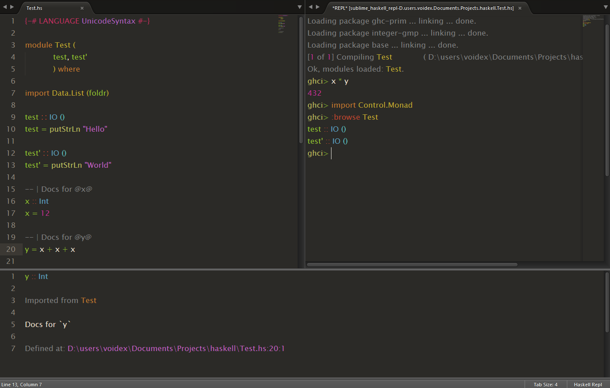

Quick link ==> SublimeHaskell's [Documentation](SubHaskEditing.md)

Setup
-----

### Required (Before You Install SublimeHaskell)

You will need to install the GHC Haskell compiler, the `cabal` build tool and a backend before you install SublimeHaskell.

* [The Glorious Haskell Computer (ghc)](https://www.haskell.org/downloads). Preferably, you should install the Haskell Platform if you don't already have a Haskell development and hacking environment set up.
* [cabal](https://www.haskell.org/cabal/). Under normal circumstances, `cabal` should come pre-installed with your Haskell environment, e.g., if you installed the Haskell Platform.
* A backend. SublimeHaskell communicates with the backend to support the interesting editing features. The preferred backend is `hsdev`. You can use one of the deprecated backends, __but know that support for these backends may be dropped or removed in a future SublimeHaskell release.__
  * [hsdev](http://hackage.haskell.org/package/hsdev) cabal package (`cabal install hsdev`) for inspection, enhanced completion, goto, symbol info etc.
  * Deprecated backends
    * [ghc-mod](http://hackage.haskell.org/package/ghc-mod) (for import and LANGUAGE completions and type inference, `cabal install ghc-mod`, not used if `hsdev` enabled, `ghc-mod` is used by `hsdev` as a library)

### Install SublimeHaskell

1. Get Sublime Text: <http://www.sublimetext.com/>
2. Install the Sublime Package Control package: <http://wbond.net/sublime_packages/package_control/installation>
3. Use Package Control to install SublimeHaskell

Open a Haskell source file, `cabal` builder file or a `stack.yaml` builder and have a productive Haskell development session!

### Optional Tools

* [stack](https://docs.haskellstack.org/en/stable/README/). The Haskell Tool Stack. If you installed the Haskell Platform, you already have this installed. `stack` is a companion Haskell build tool that supplements `cabal`.
* [SublimeREPL](https://github.com/wuub/SublimeREPL) package for REPL support, if you want to interact with GHCI from within SublimeText.
* Code prettifier:
  * [stylish-haskell](https://github.com/jaspervdj/stylish-haskell) (`cabal install stylish-haskell`)
  * [hindent](https://github.com/commercialhaskell/hindent) (`cabal install hindent`)

### Tool Installation Location

Tools (`cabal`, `hsdev`, `ghc-mod`, `ghc`, etc.) are usually installed in a directory that is already added to your `PATH` environment variable. SublimeHaskell will also look for these tools in several _"Haskell standard"_ places. These places include:

| Builder      | *nix Platforms     | Windows                      |
| ------------ | ------------------ | ---------------------------- |
| stack        | `$HOME/.local/bin` | `%APPDATA%/local/bin`        |
| cabal user   | `$HOME/.cabal/bin` | `%APPDATA/cabal/bin`         |
| cabal global | `/usr/local/bin`   | `%PROGRAMFILES%/Haskell/bin` |

More advanced users can configure `cabal`'s _user_ and _global_ install paths in `$HOME/.cabal/config`. SublimeHaskell will use these values if configured and if the directories to which they refer exist.

If you have a non-standard installation location for your tools, you can configure this in SublimeHaskell's _"User Settings"_ by adjusting `add_to_PATH`. You will have to restart SublimeText after you save your preferences.

### SublimeHaskell Theme

There is a [special theme](Themes/Hasky%20\(Dark\).gif) with enhanced Haskell entities and marks (errors, warnings and hints) coloring. Note different coloring for types and constructors (in import list, data declaration etc.), special coloring of generic variables in types, pragmas and module imports

.small.gif)

Quickstart
----------

- Open the SublimeText Command Palette ( `Ctrl-Shift-P` or `Option-Command-P` on OS X) and type `haskell` to explore SublimeHaskell's goodness.

- When editing Haskell source files, automatic error highlighting and enhanced auto-completion is available.

- Each time you save, any errors in your program will be listed at the bottom of the window and highlighted in the source code.

- All source files in the project are scanned on change. Any symbols that they export are provided in the auto-complete suggestions.

- Stylish-haskell can be used to stylish file or selected text.

- Use `F12` to go to declaration and `ctrl+k ctrl+i` to show symbol info with documentation. These commands are also available through context menu with right-click.

- To show inferred types use `Show type` (`ctrl-k ctrl-h ctrl-t`) command.

- To insert inferred type use `Insert type` (`ctrl-k ctrl-h ctrl-i`).

- You can jump between the errors and warnings with `alt+d alt+e` and `alt+shift+d alt+shift+e`.

- To show hidden error output, use command `Show error panel` (`ctrl-alt-e`)

Features and SublimeHaskell Goodness
------------------------------------

### Stack support

Build commands such as `Build`, `Clean`, `Install`, `Rebuild` uses `stack` if there is `stack.yaml` near `.cabal`. If you don't want to use `stack`, set `haskell_build_tool` setting to `cabal`.

`hsdev` uses `stack` to build dependencies and to get corresponding package-dbs. Since `0.1.7.2` it passes `--compiler` and `--arch` options to `stack` to get package-dbs built with `hsdev`-compatible compiler.

### Enhanced completion

Works in export list (showing symbols in scope), import list, expressions. Completes after module qualifier (several modules can be `import qualified as` with same qualifier). Takes into account module reexports for sources.
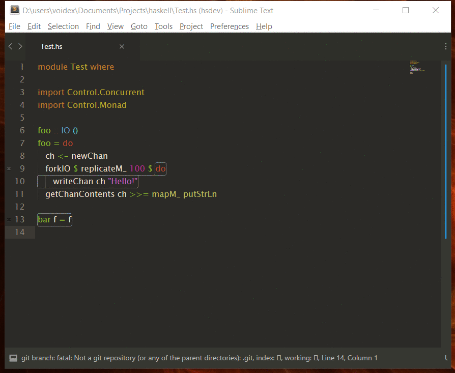

### Popups

- Show popup with symbol info and with error/warning/hint details. Requires SublimeText 3 dev build > 3116 (https://forum.sublimetext.com/t/dev-build-3116/21148).
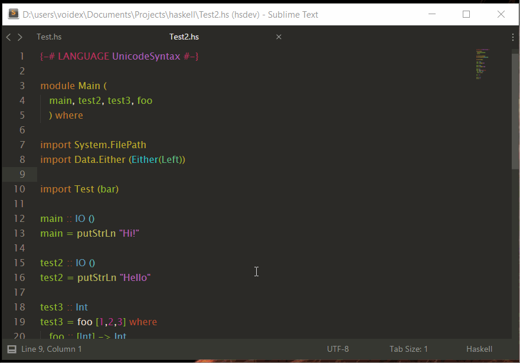

- It also shows inferred type when possible
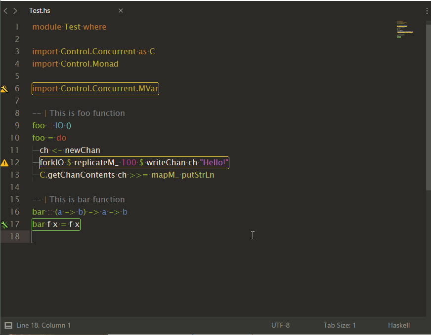

- And you can autofix warnings/hints on popup for warnings/hints
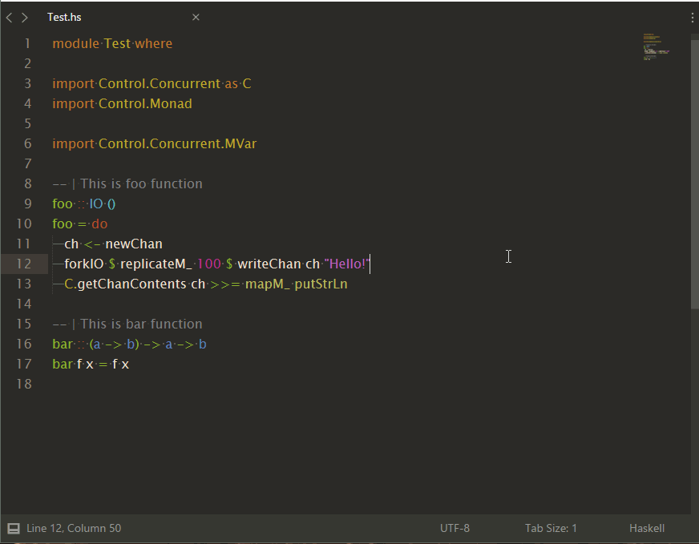

### Commands:

* `SublimeHaskell: Insert import for symbol` — add import for declaration
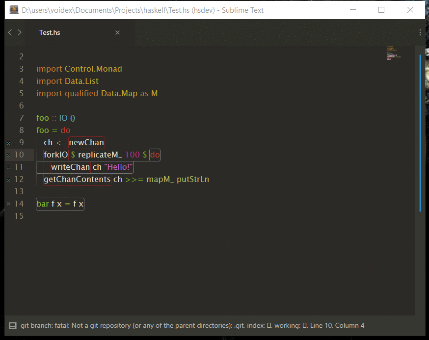
* `SublimeHaskell: Find declarations` — find declarations in installed packages and in projects
* `SublimeHaskell: Search declarations everywhere` — search declarations in hayoo too
* `SublimeHaskell: Browse module` — get declarations for module
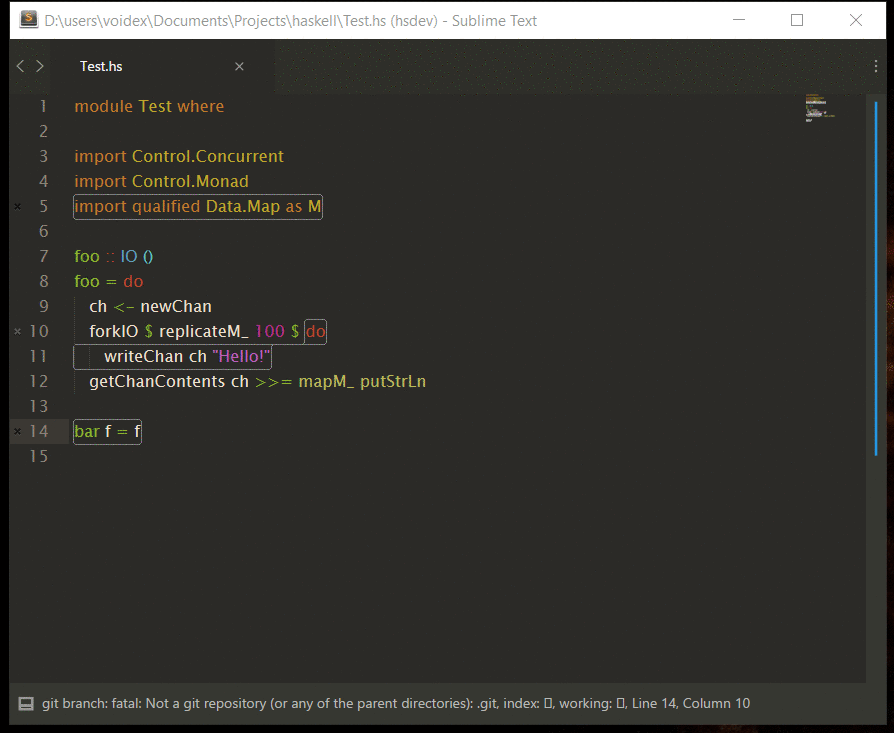
* `SublimeHaskell: Browse declarations` — get declarations in scope of current file
* `SublimeHaskell: Show symbol info` — get help for symbol, `ctrl+k ctrl+i`
* `SublimeHaskell: Toggle symbol info panel` — toggle continuout symbol info panel, which show info about symbol under cursor. Useful when reading code.
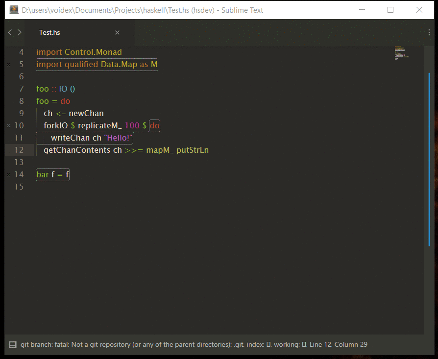
* `SublimeHaskell: Go to module` — go to module, `ctrl+k ctrl+p`
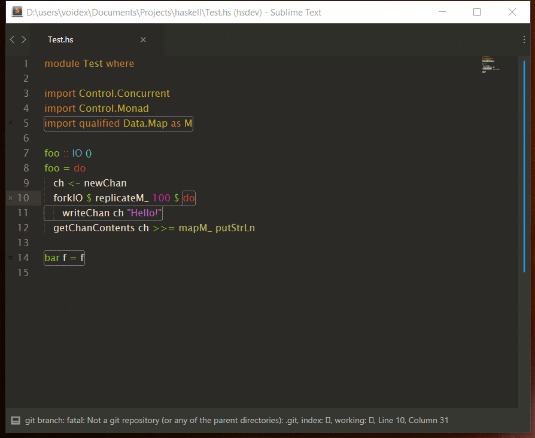
* `SublimeHaskell: Go to declaration` — overrides default, `f12`
* `Ctrl+R`, `Ctrl+Shift+R` — overrides default, goto symbol and goto symbol in project
* `SublimeHaskell: Show type` — show type/types for current expression, `ctrl-k ctrl-h ctrl-t`
* `SublimeHaskell: Expand selection to Expression` — expand selection to expression, `ctrl+shift+y`
* `SublimeHaskell: Show/hide all types` — get all types and highlight while selection modifies, `ctrl+t, h`
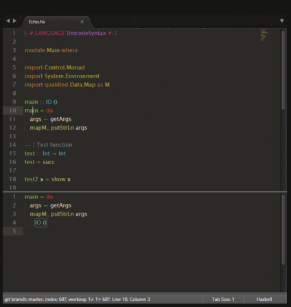
* `SublimeHaskell: Insert type` — insert type for selected expression, `ctrl-k ctrl-h ctrl-i`
* `SublimeHaskell: Hayoo` — search in hayoo
* `SublimeHaskell: Auto fix` — auto fix some of warnings and/or errors (for now redundant imports and hlint hints)
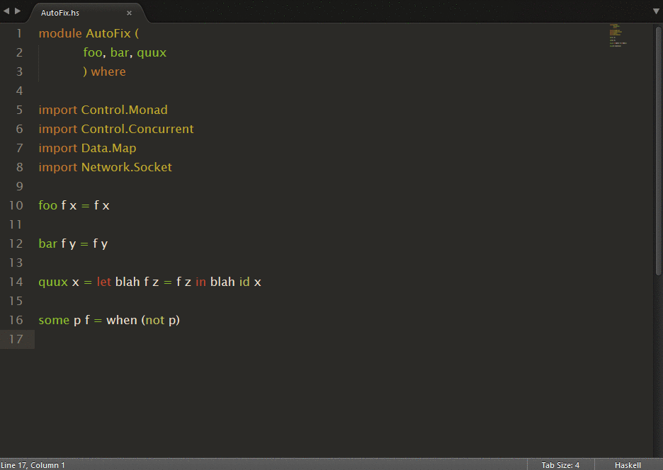
* `SublimeHaskell: Stylish` — stylish source with `stylish-haskell`
* `SublimeHaskell: Scan docs and infer types` — as long as scanning docs for sources and inferring types is long process, it's disabled by default, but this command can be used to scan docs and infer types for currently opened view
* `SublimeHaskell: Check & Lint` — check/lint/check & lint opened file. Enable option `check_lint_fly` to [check & lint](Commands/FlyCheck.gif) on idle, rescanning actual source, so that [completions are updated](Commands/ScanContents.gif)
* Eval commands — see [animation](Commands/Eval.gif)
  * `SublimeHaskell: Eval selection` — eval selected expression, for example
    * `[1..10]` ⤇ `[1,2,3,4,5,6,7,8,9,10]`
    * `replicate 10 'a'` ⤇ `aaaaaaaaaa` (note no double quotes for string result)
  * `SublimeHaskell: Apply to selection` — same as above, but applies function to each selection
    * `foobar` ⫤ `reverse` ⤇ `raboof`
    * `[1..10]` ⫤ `reverse` ⤇ `[10,9,8,7,6,5,4,3,2,1]`
    * `1`, `2`, `3` ⫤ `succ` ⤇ `2`, `3`, `4`
    * `[1..3]` ⫤ `intercalate ", " . map (\i -> "foo" ++ show i)` ⤇ `foo1, foo2, foo3`
  * `SublimeHaskell: Apply to selection list` — applies function to list made from selections
    * `foo`, `bar`, `baz` ⫤ `reverse` ⤇ `baz`, `bar`, `foo`
    * `foo`, `bar`, `baz` ⫤ `sort` ⤇ `bar`, `baz`, `foo`
* Repl commands (uses [SublimeREPL](https://github.com/wuub/SublimeREPL) package)
  * `SublimeHaskell Repl: GHCi` — runs `ghci`
  * `SublimeHaskell Repl: GHCi current file` — runs `ghci` and loads current file
  * `SublimeHaskell Repl: Cabal Repl` — runs `cabal repl` for current project
  * `SublimeHaskell Repl: Load` — loads current file or project in repl
* Context menu commands
  * `Open package on Hackage` — works within symbol info panel, opens Hackage page
  * `Open module on Hackage` — words in symbol info panel and in sources, opens Hackage page for selected module
* Build commands
  * `Build`, `Typecheck build (no codegen)`, `Clean`, `Configure`, `Rebuild`, `Install`, `Test`, `Run`
* Error commands:
  * `SublimeHaskell: Go to next error` — go to next error in file, `alt+d alt+e`
  * `SublimeHaskell: Go to previous error` — go to previous error in file, `alt+shift+d alt+shift+e`
  * `SublimeHaskell: Show error panel` — show error panel if it was hidden, `ctrl+alt+e`

#### Inside and outside your project: codex

[codex](https://hackage.haskell.org/package/codex) allows you to use ctags to jump to definitions that are declared in your cabal dependencies.

* `cabal install codex`
* Run `codex set format sublime`, that updates your `~/.codex` file to Sublime's Ctags plugin's format
* Change `~/.codex` to `tagsFileName: .tags`
* In your project, `codex cache clean && codex update`
* You can now jump to the source code of definitions outside of your project.
* The commands `CTags: Show Symbols` and `CTags: Rebuild Tags` currently don't work with `codex`

Credits
-------

Icons from [FlatIcon](http://www.flaticon.com).

Error icon by [Eleonor Wang](http://www.flaticon.com/authors/eleonor-wang) 
Warning icon by [Freepik](http://www.freepik.com) 
Hint icon by [Gregor Cresnar](http://www.flaticon.com/authors/gregor-cresnar) 
Wrench icon by [Gregor Cresnar](http://www.flaticon.com/authors/gregor-cresnar)
